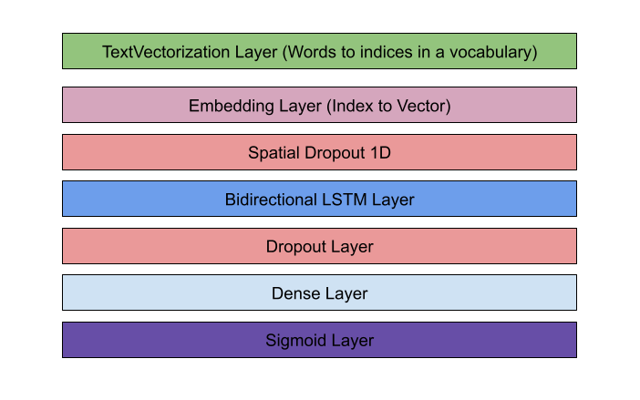
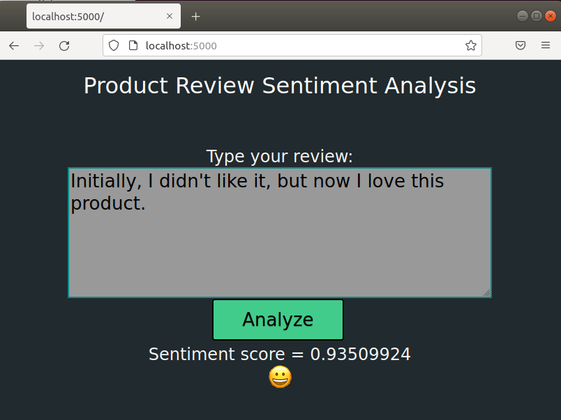

# Introduction
This is the repo for my capstone project that I am working on as part of the [Machine Learning course at Springboard](https://www.springboard.com/courses/ai-machine-learning-career-track). For the capstone project,
[different dataset problems were explored](DatasetExplored.md) and Sentiment analyzis with Amazon reviews dataset was selected. This project will use the Amazon review dataset to build a model that will predict the sentitment based on a given review

# Problem Statement
There are lot of reviews posted on Amazon for different products. We need to create a machine learning model that can predict accuratly whether the sentiment for the review posted is considered positive or negative. We assume the review is posted in English. The review can have special characters, typos and can have sentence formed incorrectly. The goal is to get a very high accuracy in the classification of the review.

# Data Format
The datasets is available in two files ["train.ft.txt.bz2"](data/train.ft.txt.bz2) and ["test.ft.txt.bz2"](data/test.ft.txt.bz2). The dataset has 568K reviews in it. The files are text file compressed using the bzip2 compression tool. The bzip2 compression format is supported by Pandas and other machine learning libraries.

There is also a smaller version of the train and test dataset for easy testing. The files are ["sample_train.ft.txt.bz2"](data/sample_train_ft.txt.bz2) and ["sample_test_ft.txt.bz2"](data/sample_test_ft.txt.bz2)

The format of the text file is as below

    __label__<sentiment><space><Review title>:<Review body>

A value of 1 for sentiment indicates a negative sentiment and a value of 2 indicates a positive sentiment. For example, here is a positive and negative reivew

    __label__2 TRULY MADE A DIFFERENCE!: I have been using this product for a couple years now. I started using it because my hair had gotten so dry from all the chemical treatments and relaxers. This actualy came in the relaxer kit. I tried it and could not beleive the difference it made with one use. I could not find it in any of the stores at the time so I searched Amazon and they had it. I absolutely love it. It is the best moisturizing product I have used so far. My hair is soft with good elasticity and it is not breaking anywhere close to what it was. I am very happy with it.

    __label__1 didn't run off of USB bus power: Was hoping that this drive would run off of bus power, but it required the adapter to actually work. :( I sent it back.

# Google Natural Language AI Service benchmark
Many cloud providers provide machine learning software as a service (SAAS). These services can be used to do sentiment analyzis on a given dataset. These SAAS model provides a standard API to access the model to do prediction. Google Cloud has a [Natural Language AI](https://cloud.google.com/natural-language) service that has sentiment analysis function. [Here is the tutorial](https://cloud.google.com/natural-language/docs/sentiment-tutorial) on how to use the Google Cloud sentiment analysis. A Jupyter Notebook was developed to use this API with smaller sample of our review dataset to get a benchmark. The serivce was slow (probably because I was using an unpaid version), so I was able to run 500 reviews through the service API. The service predicted 449 reviews correctly out of 500 reivews. 

The Jupyter Notebook code can be found under [Google language benchmark](google-benchmark)

**Based on the result, the accuracy is <mark>89.6 %</mark>**

# Explorative Data Analysis
Explorative Data Analysis was performed on the dataset. Stopwords were removed and the most common words in postive sentiment and negative sentiment was checked. It was found that some of the most common words were both used in positive and negative sentiment reviews.  The folder ["Data Wrangling and Exploration"](Data%20Wrangling%20and%20Exploration) contains the Jupyter notebook files. Here are the common words for positive and negative sentiments.

**Common words in positive reviews**

**Common words in negative reviews**

# Benchmark different model types
Using the smaller sample dataset, different model types was explored to see how well they performed and to get a base line benchmark. Three different model types Logistic Regression, Random Forest and XGBoost was tried on the dataset using [bag of words technique](https://machinelearningmastery.com/gentle-introduction-bag-words-model/). The dataset was cleaned by removing stopwords, special characters, numbers and non-english words. The [NLTK Stem package](https://www.nltk.org/api/nltk.stem.html) was used to lemmatize words to a base form. Count vector was generated using the [sklearn CountVectorizer](https://scikit-learn.org/stable/modules/generated/sklearn.feature_extraction.text.CountVectorizer.html). [Tfid transformation](https://scikit-learn.org/stable/modules/generated/sklearn.feature_extraction.text.TfidfTransformer.html) was done on the counts. The final TfidTransformed vector was used to build the three models and was tested with the sample test dataset.

The folder ["Benchmark Various Models"](Benchmark%20Various%20Models) contains the Jupyter notebook.

Here are the metrics from the three different model. The Random Forest and XGBoost provided identical results. The Logistic regression performed slightly better than Random Forest and XGBoost.

Metric            | Logistic Regression | Random Forest | XGBoost
------------------|---------------------|---------------|--------
Accuracy          |  84.6 %             | 83.8 %        |  83.8 %
F1 score          |  0.845              | 0.834         | 0.834
True Positive     |  420                | 409           | 409
True Negative     |  426                | 429           | 429
False Positive    |  76                 | 73            | 73
False Negative    |  78                 | 89            | 89

# Full scale Logistic Regression prototype
With the logistic regression performing well, a full scale Logistic Regression model with the entire dataset was tried. Given the large size of the entire dataset, a function was used to split the large single file into multiple smaller files of 10000 lines each. [SGDClassifier](https://scikit-learn.org/stable/modules/generated/sklearn.linear_model.SGDClassifier.html) provides  partial fit method to train multiple chuncks in batchs.  The [Jupyter Notebook for the full scale model prototype](Prototypes/Prototype%202%20-%20Full%20Scale%20Data.ipynb) is available under the [Prototypes folder](Prototypes). 

**The full scale prototype model gave an accuracy of <mark>86.9 %</mark>**

Metric            | Result
------------------|---------------
Accuracy          |  86.9 %             
F1 score          |  0.868             
True Positive     |  173091               
True Negative     |  174511               
False Positive    |  26909                
False Negative    |  25489                

# Prototype using Tensorflow Deep Neural Network
A script was written to [convert the dataset file into the Keras DataSet](tensorflow-prototype/convert_to_keras_dataset.py) directory structure. This script was executed to convert the full file to the Keras dataset folder.

The [prototype was developed in Jupyter Notebook](tensorflow-prototype/Sentiment%20Analysis%20using%20TensorFlow.ipynb). The traing dataset was split into training and validation dataset. The Tensorflow TextVectorization layer was used to convert the words into indices into a vocabolary of 10000 words. An embedding layer was used to convert the word index into a vector. GlobalAveragePooling1D convoluation layer was used to combine the word vectors and then a dense layer was used to output the prediction. A dropout layer was used to avoid overfitting. The model was trained over the entire dataset. 

The trained model along with the TextVectorization layer was saved to the file. Before saving, a sigmoid layer was added to convert the output to a value between 0 and 1.

**The Tensorflow prototype model gave an accuracy of <mark>90.5 %</mark>**

The Jupyter notebook was converted to a command line script to do [training](tensorflow-prototype/sentiment_trainer.py) and [prediction](tensorflow-prototype/sentiment_predicter.py). The prediction script loads the saved model and allows user to enter a text on the command line. The script then uses the model to predict the sentiment. Any sentiment value less than 0.5 is considered negative sentiment and any sentiment value greater than 0.5 is considered positive.

# Deployment
 
 [More details on the deployment can be found under the deployment folder](deployment)

## Tensorflow Model using LSTM Layer
The prototype Tensorflow training script was further improved by switching the convolution layer to a LSTM layer. The training was done on a laptop with NVIDIA GPU. [NVIDIA drivers](https://www.tensorflow.org/install/gpu) were installed to meet the requirements to train on the GPU. 

Here is the model strcuture

Here is the updated [trainer script](deployment/sentiment_lstm_trainer.py) that uses the LSTM layer

**The Tensorflow LSTM model improved the accuracy to <mark>95.1 %</mark>**

## REST API
A REST API for using the model to do predication was developed using [Python Flash webserver](https://flask.palletsprojects.com/en/2.0.x/). The REST webserver loaded the model saved by the trainer and provided a simple call to accept a review text and output a sentiment score between 0 and 1. Any sentiment score less than 0.5 is considered negative and any score above 0.5 is considered positive. More details on the REST API can be [found here](deployment)

## Web Page
A simple webpage was developed to provide a web page that can use the REST API to do prediction. The web page has a textbox where the user can enter a review. An analyze button can be selected to post the text entered by the user to the REST API. The response from the REST API is then used to indicate the sentiment to the user with emjoi icons. 

## Docker Image
The REST server script, web pages and the trained model was packaged into a docker image. The [Dockerfile](deployment/Dockerfile) defines the docker image. The image can be build and deployed to any cloud server that can host docker image. 

## AWS ECS
The docker image was deployed to [AWS ECR (Elastic Container Registry)](https://aws.amazon.com/ecr/) and then a container was deployed from the image on the [AWS ECS (Elastic Container Service)](https://aws.amazon.com/ecs/) using [Fargate (Managed server cluster)](https://aws.amazon.com/fargate/)

