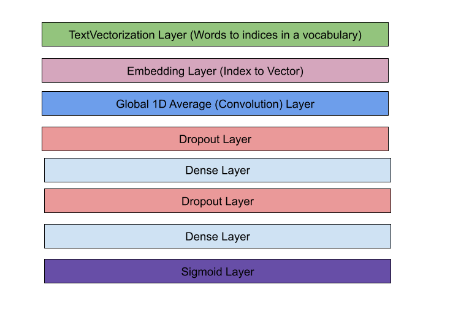
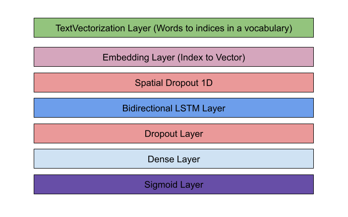
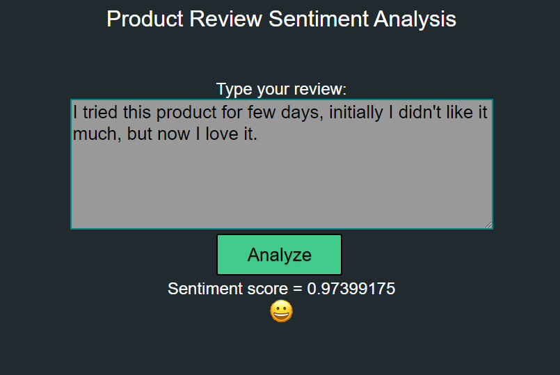

# Introduction
This is my capstone project that was done as part of my machine learning course at Springboard. The project is do sentiment analysis on product review and come up with the sentiment of the reviews.  The sentiment analysis deployment code is using Tensorflow deep learning neural network. The data for this training has to be converted to the Keras format using the [convert script](convert_to_keras_dataset.py). The [data is available under the data directory under the mllearn folder](../data).

# Initial network with convolution layer 
The [initial implementation](sentiment_trainer.py) used a convolution layer. The input layer is a TextVectorization layer that converts words into index into a vocabalory. The vocabalory size was 10000 words. The TextVectorization layer is trained separately using the "adapt" method on the layer. The layer is not trained as apart of the neural network training process. After the input layer, an embedding layer is used to convert the indices into a vector (dimension = 32). The embedding layer is trained as part of the neural network training. Then a global average pooling convolution layer is used to combine vectors. A hidden dense layer and a output dense layer is used. Dropout layers are used in between to aovid overfitting. A sigmoid layer is used to convert the final output to a value between 0 and 1. 

# Final work with LSTM layer

The [final deployment code is based on LSTM](sentiment_lstm_trainer.py), the network is similar to the initial convolution network, but a LSTM layer is used instead of a convolution layer. The LSTM layer parameters were selected to meet the requirements of CuDNN kernel so the layer can be trained on a GPU. Otherwise, the training can take days.
[See this link on how to enable GPU for Tensorflow](https://www.tensorflow.org/install/gpu)

# REST API
The [REST API server](sentiment_rest_server.py) uses flask to serve the saved model for prediction. The web server loads the saved model and adds a route /check_sentiment which calls the function "check_sentiment" which uses the model to do the prediction and returns the result as a JSON message with result value. 

**URL:** /check_sentiment

**Method:** POST

**Request Type:**  application/json

**Post Content:** JSON message with "text" field. For example:

    {
      "text" : "Text to be analyzed"
    }
	
**Response Type:** application/json

**Response Content:** A JSON message with the "result" field. For example:

    {
       "result" : 0.75
    }
	
 Any value less then 0.5 shall be considered a negative sentiment and any value greater than 0.5 shall be considered a positive sentiment. 

# Web Page
 A simple web page was developed to use the REST API and provide the end user a easy way to test the API. The [index.html](index.html) is the main page. The [index.js](index.js) has the javascript code to make the REST API and update the results. The [index.css](index.css) has styles to format the webpage.
  

# Docker Image
 The [Dockerfile](Dockerfile) has the docker image definition. A docker image can be easily built with the Dockerfile and the image can be deployed on the cloud. 

 The docker image can be build with the following command
	
     docker build --tag sentiment-rest-server .

 To see the images use the following command
     
     docker images

 To start a docker container with the image to test it 

     docker run -d --rm -p 5000:5000 sentiment-rest-server

 The -d detaches and runs the container in the background. The --rm option automatically removes the container when it exists. The -p option binds the container port 5000 to the host port 5000

 At this point, you should be able open a browser and point to http://localhost to view the page.

 To stop the docker container, run 

     docker ps -a

     docker stop <CONTAINER ID> # ID from the ps -a command

# Deploying to AWS 

## Pushing the image to AWS ECR
The docker image created should be tagged and pushed to the AWS Elastic Container Registry.
The basic step is to tag the docker image on your computer with the AWS ECR URL and push the image to the ECR.
[Here are the instructions to push a docker image to AWS ECR](https://docs.aws.amazon.com/AmazonECR/latest/userguide/docker-push-ecr-image.html)

## Setting up the ECS Service with FARGATE
The AWS ECS (Elastic Container Service) is an easy way to deploy containers. Make sure when you define the task, select the port mapping to expose port 5000.
[Here are the instructions to deploy a docker container on ECS](https://aws.amazon.com/getting-started/hands-on/deploy-docker-containers/)

